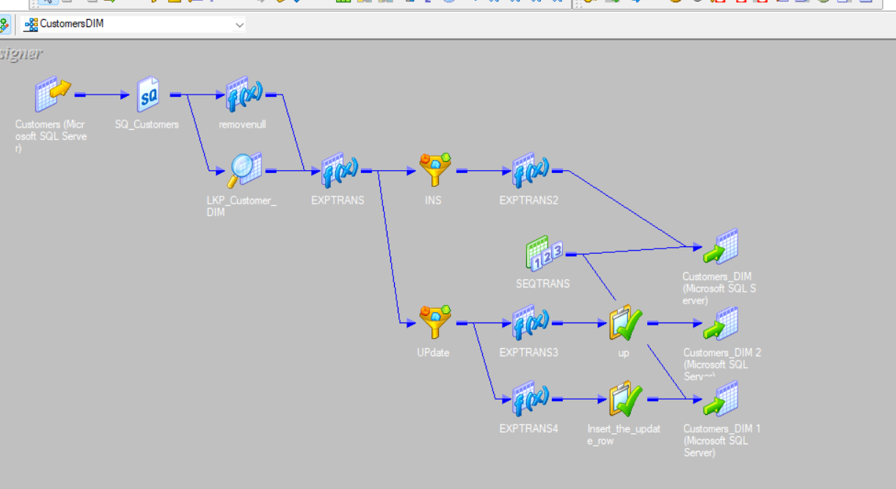
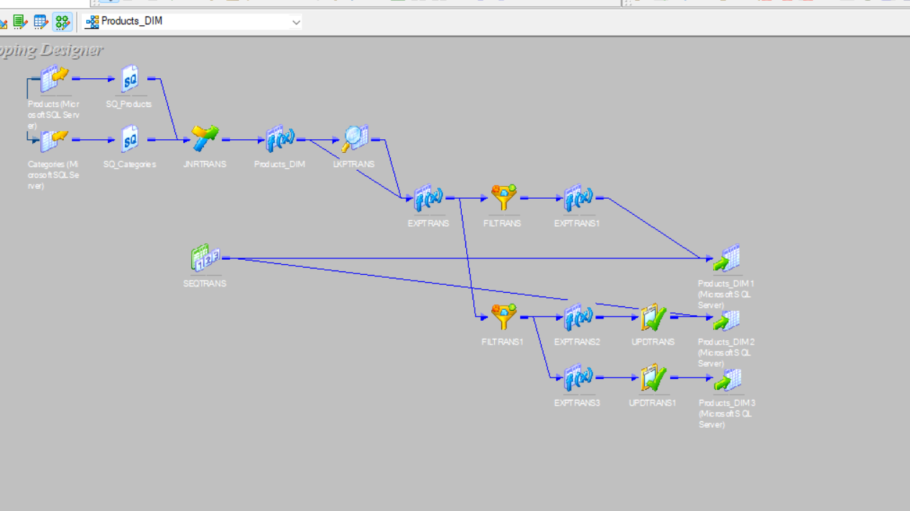
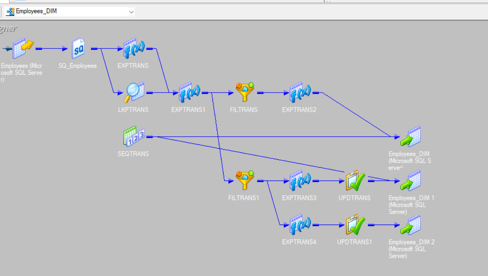
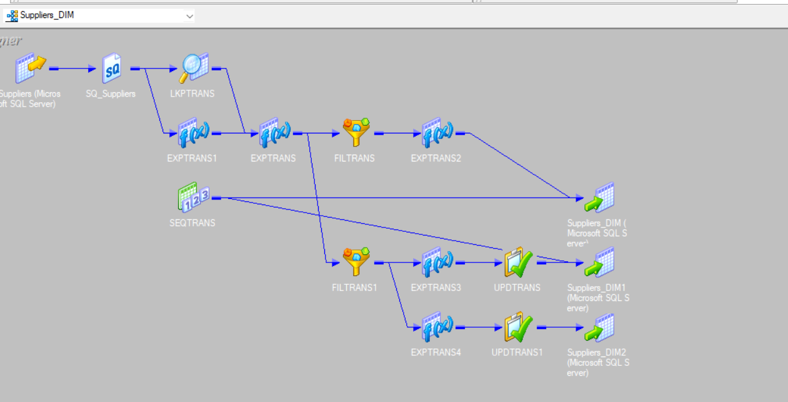
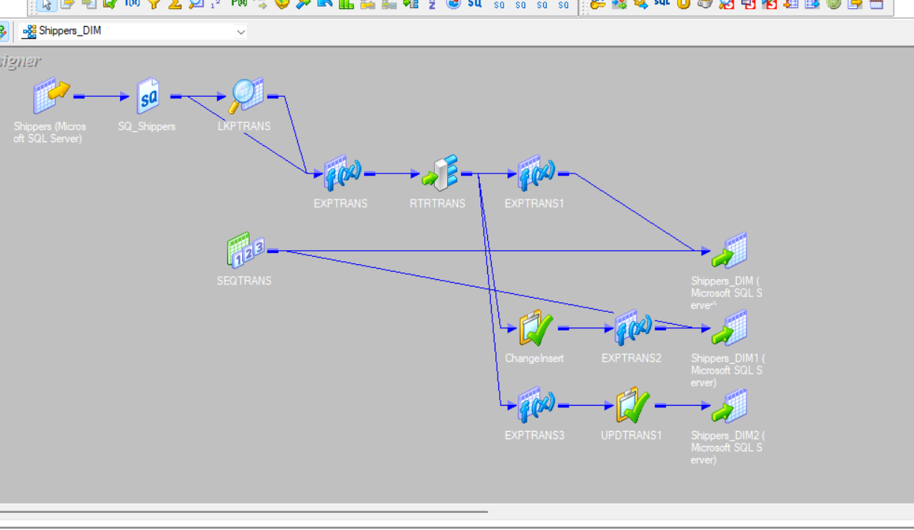
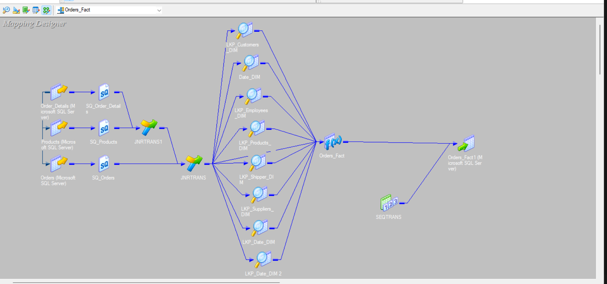
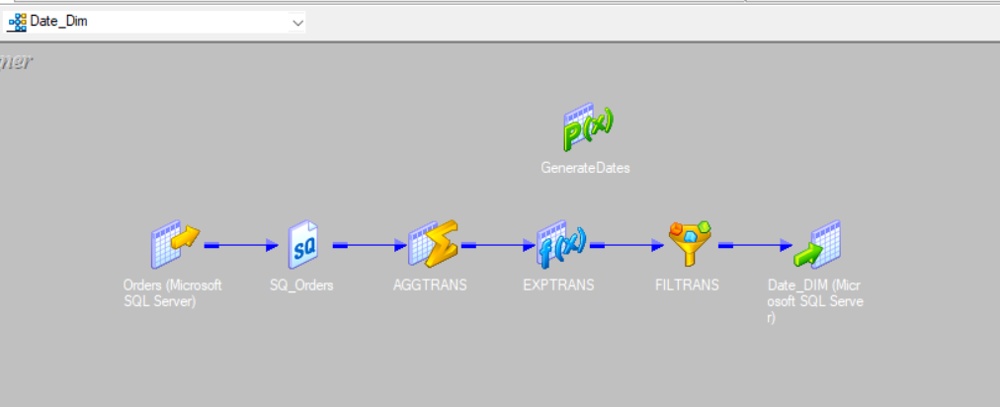
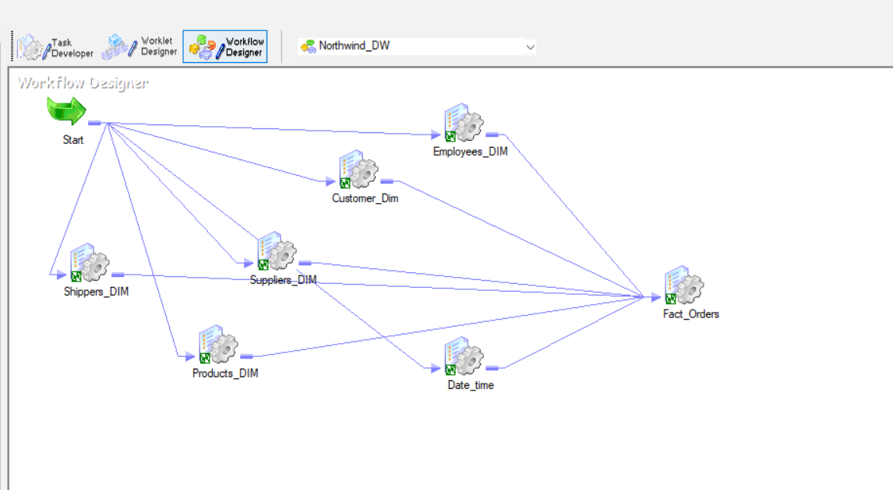
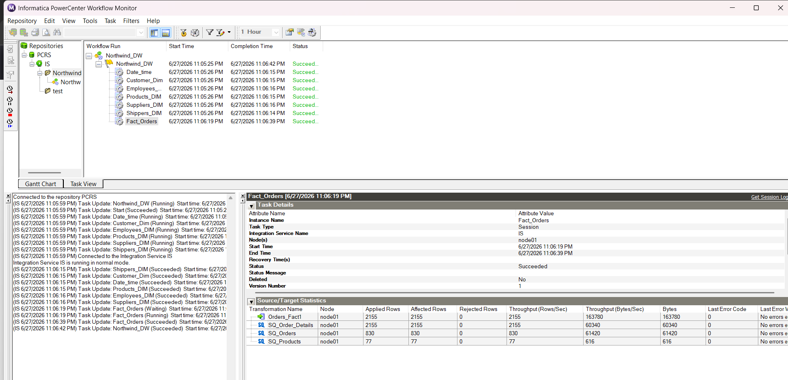

# Northwind Data Warehouse using Informatica PowerCenter

## 📌 Overview

 A complete end-to-end Data Warehouse project designed using the Northwind OLTP database. This project showcases dimensional modeling, star schema design, and ETL development using informatica powercenter

---

## ⭐ Data Warehouse Scheman
The data warehouse was designed using a Star Schema architecture, employing denormalization techniques to optimize query performance and reduce the need for complex joins. The model consists of a centralized Fact_Orders table surrounded by multiple dimension tables, enabling efficient Business Intelligence (BI) and analytical reporting.


---

## 🔄 ETL Process

The ETL process consists of:

1. Extract data from the Northwind OLTP database.
2. Transformations: Applied business logic, including data cleansing, handling null values, and flattening hierarchies. Type 2 SCD implementation for dimension history.
3. Load data into Dimension tables.

### Customers Dimension



### Products Dimension



### Employees Dimension



### Suppliers Dimension



### Shippers Dimension



### Orders Fact



### Date Dimension


### Workflow & Monitor



---

## 🛠 Technologies Used

- Informatica PowerCenter
- Microsoft SQL Server
- SQL
- ETL
- Star Schema
- Data Warehouse Concepts
---

## 🚀 How to Run

### 1. Restore the Source Database

Restore:

```
DataSource/Northwind.bak
```

using Microsoft SQL Server.

---

### 2. Create the Data Warehouse

Run:

```
Northwind_DW_Script/Northwind_DW.sql
```

---

### 3. Generate Date Dimension

Execute:

```
dbo.GenerateDates.StoredProcedure.sql
```

---

### 4. Import Informatica Mappings

Import all XML files located inside:

```
Mapping/
```

into Informatica PowerCenter Repository.

---

### 5. Configure Connections

Update:

- Source Connection
- Target Connection
- Repository Connection

according to your environment.

---

### 6. Execute Workflows

Run the mappings in the following order:

1. Date Dimension
2. Customer Dimension
3. Product Dimension
4. Employee Dimension
5. Supplier Dimension
6. Shipper Dimension
7. Orders Fact

---
## 📁 Project Structure
The repository is organized as follows:
```text
├── DataSource/
│   └── Northwind.bak                    # Source OLTP Database Backup
├── Northwind_DW_Script/
│   ├── Northwind_DW.sql                 # Target DWH Schema DDL Script
│   └── dbo.GenerateDates.StoredProcedure.sql # Date Dimension Population Script
├── Mapping/
│   └── [All Informatica XML Files]     # PowerCenter XML Exports (Mappings/Workflows)
├── image/
│   └── [All Screenshots]                # UI and Schema Screenshots
└── README.md
```
---

## 🎯 Learning Objectives

This project demonstrates:

- Data Warehouse Design
- Star Schema Modeling
- ETL Development
- Dimension Loading
- Fact Loading
- Informatica PowerCenter Development
- SQL Server Integration

---

## 👨‍💻 Author

Developed as a Data Warehouse & ETL project using Informatica PowerCenter and SQL Server.